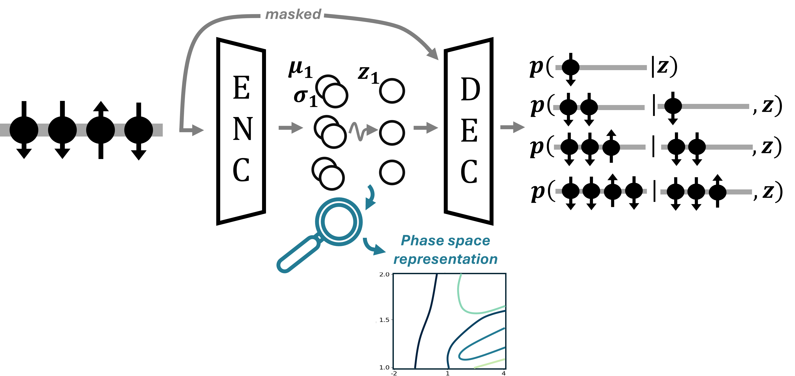

# Exploring-Latent-Representation-of-Quantum-Phase-Space-with-Variational-Auto-Encode

code used for the numerical simulation of the paper

## Structure

In [modified_nk_ARNN.py](https://github.com/PaulinDS/Exploring-Latent-Representation-of-Quantum-Phase-Space-with-Variational-Auto-Encode/blob/main/modified_nk_ARNN.py), there is the implementation of the dense ARNN taken from netket and modified to be able the latent vectors

In ...

## Package Versions

`flax 0.10.4`
`jax 0.4.38`
`jax_lib 0.4.38`
`optax 0.2.4`
`netket 3.15.2`

